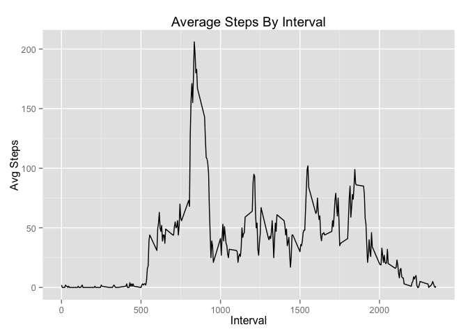

# Reproducible Research: Peer Assessment 1

## Loading and preprocessing the data

The base dataset is in zip file. Ensure we have it extracted and read it into data frame. Aslo setup some default knitr options.


```r
knitr::opts_chunk$set(warning=FALSE, message=FALSE)

dataset.zipfile <- file.path(".", "activity.zip")
dataset.csvfile <- file.path(".", "activity.csv")

if (!file.exists(dataset.csvfile)) {
    unzip(dataset.zipfile)
}
activity.data <- read.csv(dataset.csvfile)
```

## What is mean total number of steps taken per day?

Using dplyr for grouping and aggregation. Tranform date from factor to Posixlt type. Using ggplot contruct histogram of steps by date. Finally display total, mean and median by date.


```r
library(dplyr)
library(ggplot2)
library(scales)

total_steps_by_date <- activity.data %>% 
    group_by(date) %>%
    summarise(Count = n(), Total = sum(steps), 
              Mean = mean(steps, na.rm = TRUE), 
              Median = median(steps, na.rm = TRUE)) %>%
    transform(Date = strptime(date, "%Y-%m-%d")) %>%
    select(Date, Count, Total, Mean, Median)

p <- ggplot(total_steps_by_date, aes(x=Date, y=Total))
p + geom_histogram(stat="identity") +
    labs(title = "Total Steps By Day", x = "Day", y = "Total Steps")
```

 

```r
total_steps_by_date
```

```
##          Date Count Total       Mean Median
## 1  2012-10-01   288    NA        NaN     NA
## 2  2012-10-02   288   126  0.4375000      0
## 3  2012-10-03   288 11352 39.4166667      0
## 4  2012-10-04   288 12116 42.0694444      0
## 5  2012-10-05   288 13294 46.1597222      0
## 6  2012-10-06   288 15420 53.5416667      0
## 7  2012-10-07   288 11015 38.2465278      0
## 8  2012-10-08   288    NA        NaN     NA
## 9  2012-10-09   288 12811 44.4826389      0
## 10 2012-10-10   288  9900 34.3750000      0
## 11 2012-10-11   288 10304 35.7777778      0
## 12 2012-10-12   288 17382 60.3541667      0
## 13 2012-10-13   288 12426 43.1458333      0
## 14 2012-10-14   288 15098 52.4236111      0
## 15 2012-10-15   288 10139 35.2048611      0
## 16 2012-10-16   288 15084 52.3750000      0
## 17 2012-10-17   288 13452 46.7083333      0
## 18 2012-10-18   288 10056 34.9166667      0
## 19 2012-10-19   288 11829 41.0729167      0
## 20 2012-10-20   288 10395 36.0937500      0
## 21 2012-10-21   288  8821 30.6284722      0
## 22 2012-10-22   288 13460 46.7361111      0
## 23 2012-10-23   288  8918 30.9652778      0
## 24 2012-10-24   288  8355 29.0104167      0
## 25 2012-10-25   288  2492  8.6527778      0
## 26 2012-10-26   288  6778 23.5347222      0
## 27 2012-10-27   288 10119 35.1354167      0
## 28 2012-10-28   288 11458 39.7847222      0
## 29 2012-10-29   288  5018 17.4236111      0
## 30 2012-10-30   288  9819 34.0937500      0
## 31 2012-10-31   288 15414 53.5208333      0
## 32 2012-11-01   288    NA        NaN     NA
## 33 2012-11-02   288 10600 36.8055556      0
## 34 2012-11-03   288 10571 36.7048611      0
## 35 2012-11-04   288    NA        NaN     NA
## 36 2012-11-05   288 10439 36.2465278      0
## 37 2012-11-06   288  8334 28.9375000      0
## 38 2012-11-07   288 12883 44.7326389      0
## 39 2012-11-08   288  3219 11.1770833      0
## 40 2012-11-09   288    NA        NaN     NA
## 41 2012-11-10   288    NA        NaN     NA
## 42 2012-11-11   288 12608 43.7777778      0
## 43 2012-11-12   288 10765 37.3784722      0
## 44 2012-11-13   288  7336 25.4722222      0
## 45 2012-11-14   288    NA        NaN     NA
## 46 2012-11-15   288    41  0.1423611      0
## 47 2012-11-16   288  5441 18.8923611      0
## 48 2012-11-17   288 14339 49.7881944      0
## 49 2012-11-18   288 15110 52.4652778      0
## 50 2012-11-19   288  8841 30.6979167      0
## 51 2012-11-20   288  4472 15.5277778      0
## 52 2012-11-21   288 12787 44.3993056      0
## 53 2012-11-22   288 20427 70.9270833      0
## 54 2012-11-23   288 21194 73.5902778      0
## 55 2012-11-24   288 14478 50.2708333      0
## 56 2012-11-25   288 11834 41.0902778      0
## 57 2012-11-26   288 11162 38.7569444      0
## 58 2012-11-27   288 13646 47.3819444      0
## 59 2012-11-28   288 10183 35.3576389      0
## 60 2012-11-29   288  7047 24.4687500      0
## 61 2012-11-30   288    NA        NaN     NA
```

## What is the average daily activity pattern?

Compute means for each interval across all days. Plot this, and display the interval with the maximum average number of steps.


```r
interval_means <- activity.data %>%
    group_by(interval) %>%
    summarise(Mean = round(mean(steps, na.rm = TRUE), 0), Median = median(steps, na.rm = TRUE)) %>%
    select(Interval = interval, Mean, Median)

pm <- ggplot(interval_means, aes(x=Interval, y=Mean))
pm + geom_line() + labs(title = "Average Steps By Interval", y = "Avg Steps")
```

 

```r
filter(interval_means, Mean == max(interval_means$Mean))
```

```
## Source: local data frame [1 x 3]
## 
##   Interval Mean Median
## 1      835  206     19
```

## Imputing missing values

The number of rows with missing data are:


```r
nrow(filter(activity.data, is.na(steps)))
```

```
## [1] 2304
```

Impute values using the mean for the corresponding interval and merge into original data set. Again plot historgram and table with Total, Mean and Median by date.


```r
imputed_activity_data <- select(interval_means, Interval, IntervalMean = Mean) %>%
    inner_join(activity.data, by = c("Interval" = "interval")) %>%
    mutate(steps = ifelse(is.na(steps), IntervalMean, steps)) %>%
    select(Interval, Steps = steps, Date = date)

imputed_total_steps_by_date <- imputed_activity_data %>% 
    group_by(Date) %>%
    summarise(Count = n(), Total = sum(Steps), 
              Mean = mean(Steps, na.rm = TRUE), 
              Median = median(Steps, na.rm = TRUE)) %>%
    transform(Date = strptime(Date, "%Y-%m-%d"))

ph_imputed <- ggplot(imputed_total_steps_by_date, aes(x=Date, y=Total))
ph_imputed + geom_histogram(stat="identity") +
    labs(title = "Total Steps By Day (Imputed Values)", x = "Day", y = "Total Steps")
```

 

```r
imputed_total_steps_by_date
```

```
##          Date Count Total       Mean Median
## 1  2012-10-01   288 10762 37.3680556   34.5
## 2  2012-10-02   288   126  0.4375000    0.0
## 3  2012-10-03   288 11352 39.4166667    0.0
## 4  2012-10-04   288 12116 42.0694444    0.0
## 5  2012-10-05   288 13294 46.1597222    0.0
## 6  2012-10-06   288 15420 53.5416667    0.0
## 7  2012-10-07   288 11015 38.2465278    0.0
## 8  2012-10-08   288 10762 37.3680556   34.5
## 9  2012-10-09   288 12811 44.4826389    0.0
## 10 2012-10-10   288  9900 34.3750000    0.0
## 11 2012-10-11   288 10304 35.7777778    0.0
## 12 2012-10-12   288 17382 60.3541667    0.0
## 13 2012-10-13   288 12426 43.1458333    0.0
## 14 2012-10-14   288 15098 52.4236111    0.0
## 15 2012-10-15   288 10139 35.2048611    0.0
## 16 2012-10-16   288 15084 52.3750000    0.0
## 17 2012-10-17   288 13452 46.7083333    0.0
## 18 2012-10-18   288 10056 34.9166667    0.0
## 19 2012-10-19   288 11829 41.0729167    0.0
## 20 2012-10-20   288 10395 36.0937500    0.0
## 21 2012-10-21   288  8821 30.6284722    0.0
## 22 2012-10-22   288 13460 46.7361111    0.0
## 23 2012-10-23   288  8918 30.9652778    0.0
## 24 2012-10-24   288  8355 29.0104167    0.0
## 25 2012-10-25   288  2492  8.6527778    0.0
## 26 2012-10-26   288  6778 23.5347222    0.0
## 27 2012-10-27   288 10119 35.1354167    0.0
## 28 2012-10-28   288 11458 39.7847222    0.0
## 29 2012-10-29   288  5018 17.4236111    0.0
## 30 2012-10-30   288  9819 34.0937500    0.0
## 31 2012-10-31   288 15414 53.5208333    0.0
## 32 2012-11-01   288 10762 37.3680556   34.5
## 33 2012-11-02   288 10600 36.8055556    0.0
## 34 2012-11-03   288 10571 36.7048611    0.0
## 35 2012-11-04   288 10762 37.3680556   34.5
## 36 2012-11-05   288 10439 36.2465278    0.0
## 37 2012-11-06   288  8334 28.9375000    0.0
## 38 2012-11-07   288 12883 44.7326389    0.0
## 39 2012-11-08   288  3219 11.1770833    0.0
## 40 2012-11-09   288 10762 37.3680556   34.5
## 41 2012-11-10   288 10762 37.3680556   34.5
## 42 2012-11-11   288 12608 43.7777778    0.0
## 43 2012-11-12   288 10765 37.3784722    0.0
## 44 2012-11-13   288  7336 25.4722222    0.0
## 45 2012-11-14   288 10762 37.3680556   34.5
## 46 2012-11-15   288    41  0.1423611    0.0
## 47 2012-11-16   288  5441 18.8923611    0.0
## 48 2012-11-17   288 14339 49.7881944    0.0
## 49 2012-11-18   288 15110 52.4652778    0.0
## 50 2012-11-19   288  8841 30.6979167    0.0
## 51 2012-11-20   288  4472 15.5277778    0.0
## 52 2012-11-21   288 12787 44.3993056    0.0
## 53 2012-11-22   288 20427 70.9270833    0.0
## 54 2012-11-23   288 21194 73.5902778    0.0
## 55 2012-11-24   288 14478 50.2708333    0.0
## 56 2012-11-25   288 11834 41.0902778    0.0
## 57 2012-11-26   288 11162 38.7569444    0.0
## 58 2012-11-27   288 13646 47.3819444    0.0
## 59 2012-11-28   288 10183 35.3576389    0.0
## 60 2012-11-29   288  7047 24.4687500    0.0
## 61 2012-11-30   288 10762 37.3680556   34.5
```

## Are there differences in activity patterns between weekdays and weekends?

Using imputed activity data, construct a factor for weekend/weekday, note we don't carry through the PosixDate field as it is unsupported by dplyr.

Then group the data by Weekday and Interval and plot it, using facet.


```r
activity_data_with_weekday <- imputed_activity_data %>%
    transform(PosixDate = strptime(Date, "%Y-%m-%d")) %>%
    mutate(Weekday = factor(!grepl("Sat|Sun", weekdays(PosixDate, abbreviate = TRUE)), labels = c("weekend", "weekday"))) %>%
    select(Date, Interval, Steps, Weekday)

interval_means_with_weekday <- activity_data_with_weekday %>%
    group_by(Weekday, Interval) %>%
    summarise(Mean = round(mean(Steps, 0))) %>%
    select(Interval, Mean, Weekday)

p_by_weekday <- ggplot(interval_means_with_weekday, aes(x=Interval, y=Mean))
p_by_weekday + geom_line() + facet_grid(. ~ Weekday) + labs(title = "Average Steps By Interval", y = "Avg Steps")
```

 
